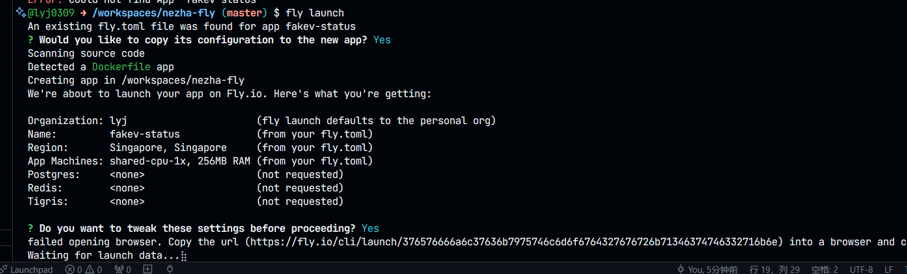
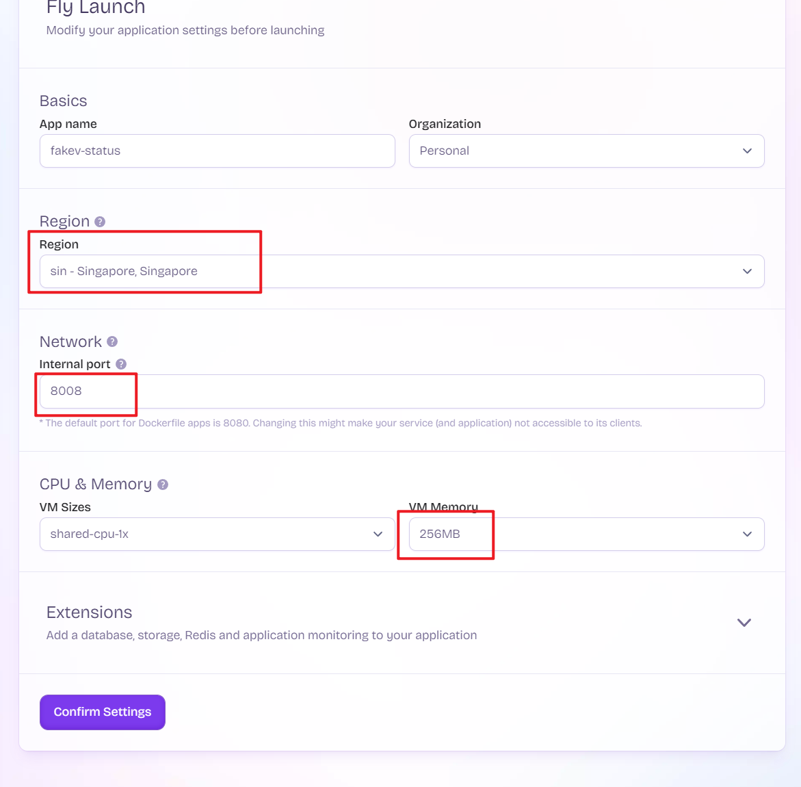
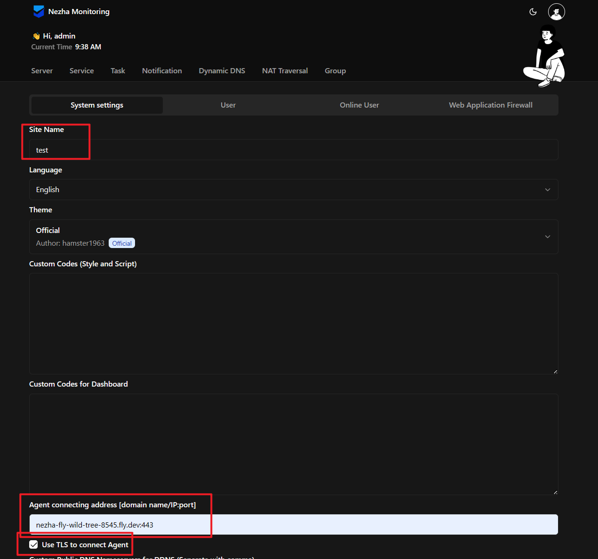
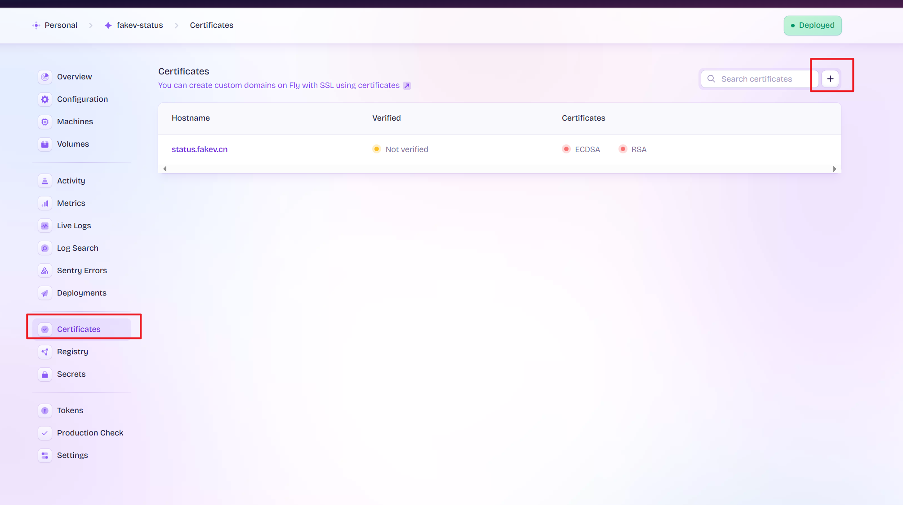
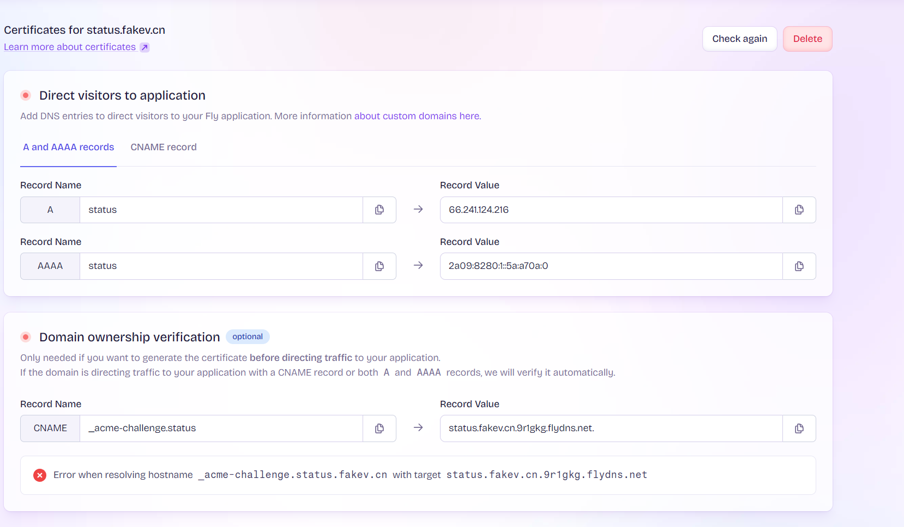

# nezha-fly
## 部署哪吒面板到fly.io
适用v1
## 原理
通过基于原哪吒面板的docker镜像，在fly.io中mount做持久化储存 

https://fly.io/docs/volumes/overview/

action secrets 
`FLY_API_TOKEN`: fly的api token

## 首次部署

1. 修改fly.toml的`app`成你的，运行`fly launch`创建一个app,然后进行配置选择


2. 部署完成后，登录站点继续配置，比如站点名称，url


## 使用自己域名

添加dns record即可


## 导入导出配置数据
### 导出
```shell
# config  
fly ssh sftp get /dashboard/data/config.yaml -a {your-app-name}  

# db  
fly ssh sftp get /dashboard/data/sqlite.db -a {your-app-name}
```
### 导入
```
fly ssh sftp shell -a {your-app-name}
put {filename}  /dashboard/data/
```
## 自动更新
action有定时检查更新脚本，会定期运行，如果有更新会自动同步

## 展示网址 （<https://status.fakev.cn>）
